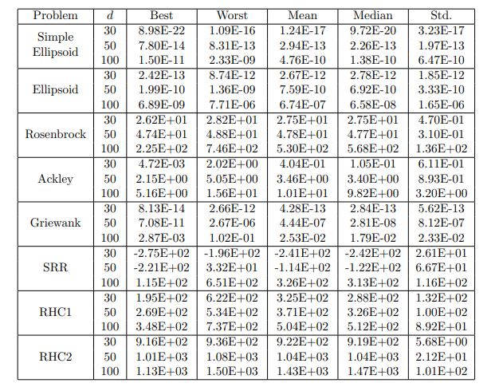
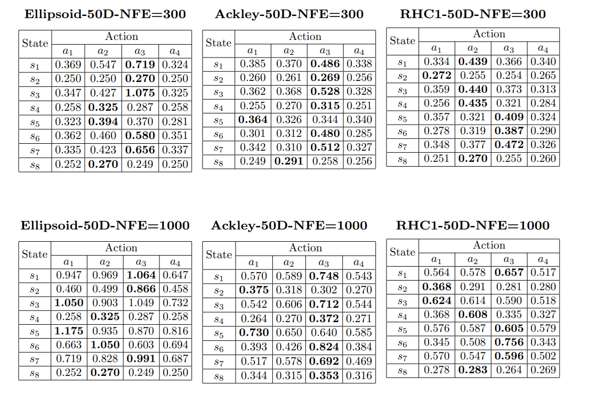
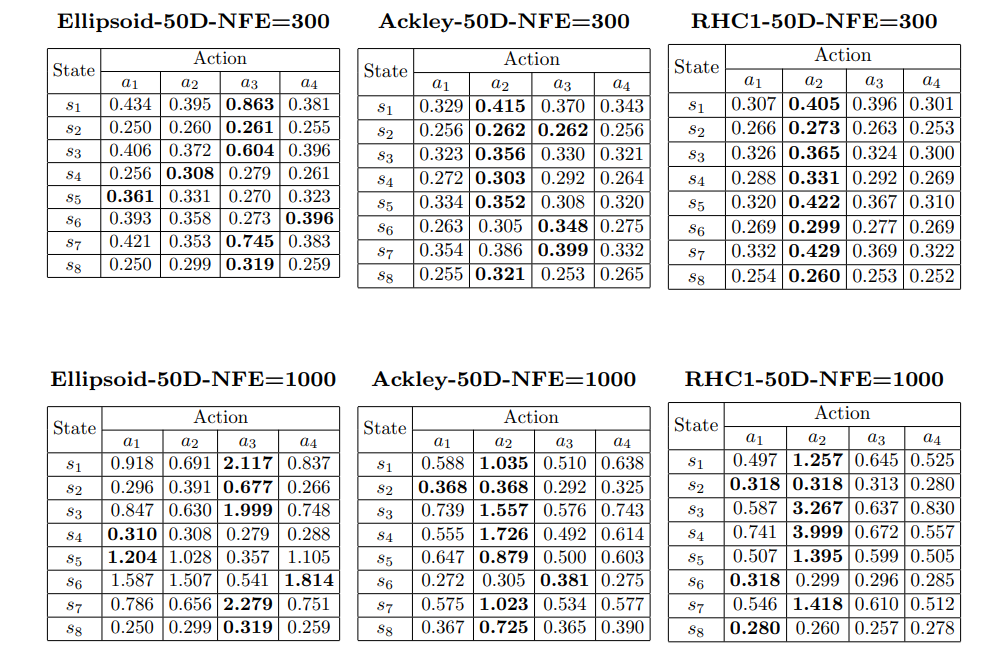

# 實驗結果

本文件彙整實驗結果，有ESA結果、決策Agent比較、代理模型比較，以及Q-learning策略偏好的實驗結果。所有實驗固定 NFE=1000，測試函數包含 Simple Ellipsoid、Ellipsoid、Rosenbrock、Ackley、Griewank、SRR、RHC1、RHC2，每組維度各執行 10 次取平均。

---

## 1. ESA 詳細結果

本表為 ESA（Q-learning + RBF_hpo）在 30D / 50D / 100D 各測試函數上的結果，作為後續所有比較實驗的基準。

---

## 2. Q-learning vs 非學習型 Agent（Random / Seq / Alter）

研究問題：Q-learning 的動態策略選擇，是否真的優於固定規則的基準 Agent？

- Random：每步隨機選擇一個策略
- Seq：依序循環使用所有策略
- Alter：在 DE（a1）與 SLS（a2）之間交替

.png)

---

## 3. Q-learning vs Thompson Sampling vs UCB1

研究問題：同樣使用 RBF_hpo 作為代理模型，不同強化學習／Bandit 決策 Agent 的表現差異為何？

- Thompson Sampling（TS）：貝葉斯 Bandit，以後驗分佈取樣選擇策略，不考慮狀態
- UCB1：樂觀 Bandit，透過上信賴界選擇策略，不考慮狀態

---

## 4. Q-learning + RBF_hpo vs Q-learning + GB vs Q-learning + RBF

研究問題：固定使用 Q-learning 決策 Agent，不同代理模型對最終優化效果的影響為何？

- GB（Gradient Boosting）：梯度提升樹代理模型
- RBF（simple）：基礎RBF，無超參最佳化

---

## 5. ESA Q-Table 分析（標準 4 策略）

研究問題：Q-learning 在搜尋過程中學到了什麼策略偏好？

下表為 Q-learning 在標準 4 策略配置（a1=DE、a2=SLS、a3=crossover、a4=TRLS）下，所有 run 的平均 Q-Table，分別呈現 NFE=300（早期）與 NFE=1000（結束）兩個時間點。  
橫軸為動作a（策略），縱軸為狀態s（上一步動作是否成功改善的組合），數值越高代表該狀態下越傾向選擇該策略。

---

## 6. a5 取代 a2 的 Q-Table 分析

研究問題：以 L-BFGS（a5）取代 SLS（a2）後，Q-learning 的策略偏好是否發生改變？

此配置將 a2 由隨機局部搜尋（SLS）替換為 L-BFGS 擬牛頓法，維持 4 策略架構（a1=DE、a2=L-BFGS、a3=crossover、a4=TRLS）。與表格五對照，可觀察 Q-learning 對於「梯度輔助局部搜尋」的偏好程度是否不同於原本的隨機局部搜尋。

